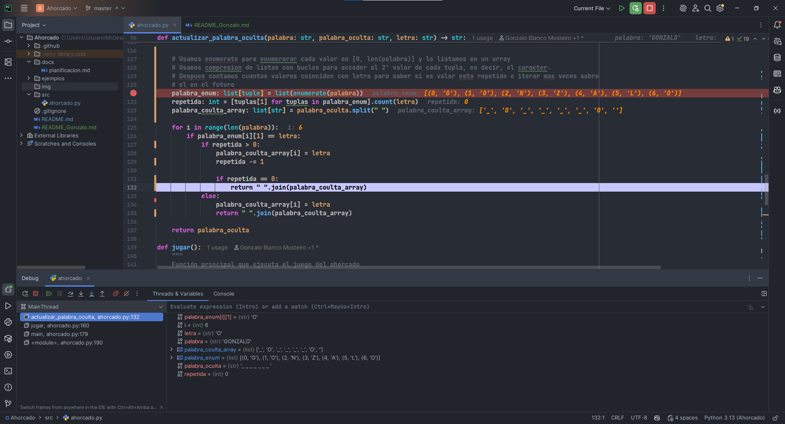
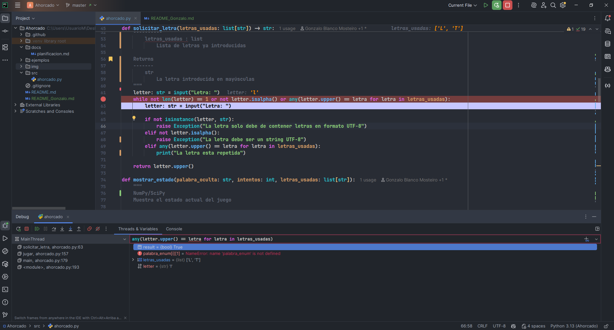

# El Juego del Ahorcado — README

> CLI que El juego del "ahorcado" es un juego de lápiz y papel, en el que el objetivo es adivinar una palabra. Un jugador piensa una palabra y el otro jugador 
> debe ir diciendo letras que cree que puede contener la palabra. Si acierta, se escriben todas las letras coincidentes. Si la letra no está, se resta un intento, agregando una parte al cuerpo (cabeza, brazo, etc.) hasta que queda dibujado todo el cuerpo del "ahorcado".
> **Gana el juego** si se completa la palabra, y **se pierde** si se completa el número de intentos antes de completar la palabra.
> En nuestra versión del ahorcado, **no dibujaremos el cuerpo, sino que esta parte se simulará estableciendo un número de intentos, por ejemplo **5 intentos**.
---

## 1) Descripción del módulo

Este proyecto implementa una **calculadora binaria de 8 bits** que opera con **enteros sin signo**.
- Simplemente se ejecuta el mainn


---

## 2) Requisitos

- **Python 3.10 o superior**.
- **Sin dependencias externas obligatorias.**
- Si en algún momento se añaden librerías, se listarán en el archivo **`dependecias.txt`** (ver sección 5).

---

## 3) Instalación de Python

### 3.1 Linux

#### Debian/Ubuntu (y derivados)
```bash
sudo apt update
sudo apt install -y python3 python3-pip python3-venv
python3 --version
python3 -m pip --version
```

#### Fedora
```bash
sudo dnf install -y python3 python3-pip python3-virtualenv
python3 --version
python3 -m pip --version
```

#### Arch/Manjaro
```bash
sudo pacman -S --needed python python-pip
python --version
python -m pip --version
```

> **Entorno virtual (opcional recomendado)**
```bash
python3 -m venv .venv
# Activar:
# Linux/macOS:
source .venv/bin/activate
# (Salir: 'deactivate')
```

### 3.2 Windows

#### Opción A — Microsoft Store
1. Abrir **Microsoft Store**, buscar **Python 3.x** (Python Software Foundation).
2. Instalar y verificar:
```powershell
py --version
py -m pip --version
```

#### Opción B — Instalador oficial
1. Descargar desde **https://www.python.org/downloads/** el instalador de Python 3.x.
2. **Marcar** “**Add Python to PATH**” durante la instalación.
3. Verificar:
```powershell
py --version
py -m pip --version
```

> **Entorno virtual (opcional)**
```powershell
py -m venv .venv
.\.venv\Scripts\Activate.ps1
# (Salir: 'deactivate')
```

---

## 4) Ejecución del módulo

### Sintaxis general
```bash
python nombre_modulo.py
```

> En Windows puedes usar `py` en lugar de `python`.
> En Linux, si conviven varias versiones, usa `python3`.

### Ejemplos

**Suma explícita**
```bash
# Linux/macOS
python nombre_modulo.py

# Windows
py nombre_modulo.py
```

>
---

## 5) Dependencias con `dependecias.txt` (opcional)

El archivo **`dependecias.txt`** lista, una por línea, las librerías Python que requiere el proyecto (si las hubiera).
Ejemplo de contenido:
```txt
# Ejemplos
colorama==0.4.6
rich>=13.0
pytest
```

### Instalación de dependencias
> Usa el intérprete para invocar `pip` y evitar confusiones con `pip`/`pip3`.
```bash
# Linux/macOS
python3 -m pip install -r dependecias.txt

# Windows (PowerShell/CMD)
py -m pip install -r dependecias.txt
```

Si el archivo **no existe** o **está vacío**, el proyecto **no requiere** dependencias externas.

---


## 6) Mensajes de error y códigos de salida

- **Palabra/letra introducida** (palabra < 5 y/o palabra < 0, letra ya introducia, caracter no valido, dato no esperadoe etc..)
- Mensaje: `→ [ERROR] <msg>`

---

## 7) Problemas frecuentes (FAQ)

- **“python: command not found” / “py no se reconoce”** → Instala Python o ajusta el **PATH** (ver sección 3).
- **“pip no se reconoce”** → Usa `python -m pip` (o `py -m pip` en Windows).
- **Formato de operando incorrecto** → Revisa que sean solo `0`/`1` y longitud ≤ 8.
- **Signo en posición incorrecta** → Asegúrate de usar `OPERANDO1 [SIGNO] OPERANDO2`.

---
## 8) Documentacion
- Se ha documentado algunas funciones ya escritas con documentación NumPy/SciPy
- Se ha documentado una funcion con epitexto

## 9) Depuracion
Las siguiente imagenes son simulaciones de cuando depure por necesidad varias veces intentando solucionar el error:
- La 1º imagen necesite depurar varias veces para saber como se evaluaban ciertos valores de modo que me permitio saber donde estaba el fallo a la hora de continuar la iteracion en caracteres repetidos

- La 2º imagen necesite depurar para saber que valor retornaba `any(letter.upper() == letra for letra in letras_usadas)` y me di cuenta que tenia mal una variable y ademas me faltaba `<str>.upper()`

